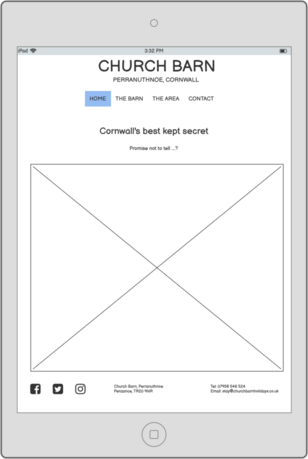
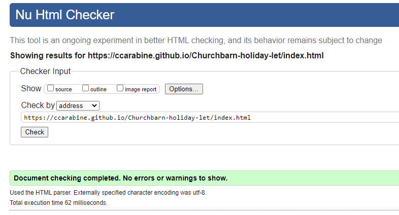
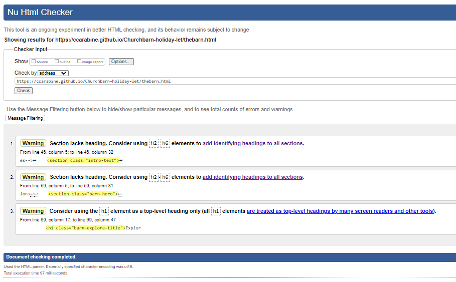
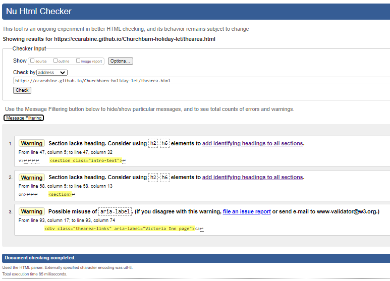
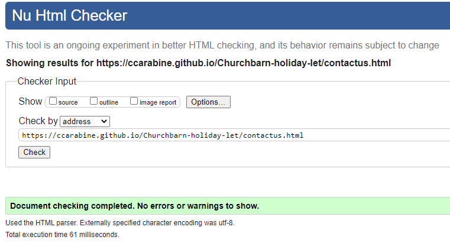
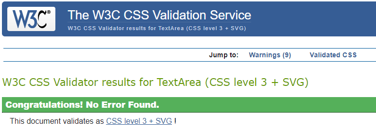

***

# Project Overview

intro text
Church Barn live site<a href="https://ccarabine.github.io/Churchbarn-holiday-let/">

## Church Barn holiday let

Image from  <a href="http://ami.responsivedesign.is/">Am I Responsive</a>, to display the websites home page across mobile, tablet and desktop.

***
# Table of Contents

1. [User Experience (UX)](#ux)
    * [Strategy](#strategy)
        * [Project Objectives & Goals](#goals)
        * [User Stories](#userstories)
        * [Strategy Tradeoffs](tradeoffs)
    * [Scope](#scope)
    * [Skeleton](#skeleton)
        * [Wireframes](#wireframes)
    * [Surface](#design)
        * [Colours](#colours)
        * [Typography](#typography)
        * [Imagery](#imagery)

2. [Features](#features)
    * [Current Features](#features-current)
    * [Features to implement](#features-toimplement)

3. [Technologies Used](#technology-used)

4. [Testing](#testing)
    * [User Stories Testing](#user-testing)
    * [Validation Testing](#validation-testing)

5. [Deployment](#deployment)

6. [Credits](#credits)

7. [Acknowledgements](#acknowledgements)

# User Experience (UX) 

## 1. Strategy 

***

Church Barn is a lovingly converted barn, and holiday let in the sleepy village of Perranuthnoe, Southwest Cornwall. It is a place close to my heart, especially during the last year of lockdown, where we all learnt not to take our freedom to travel for granted.

To date, Church Barn has been listed on a holiday letting marketplace, who list the property amongst other competing properties in the area, they have full control/ownership of the brand, provide online booking, and charge high fees/commission.

## Vision:
Now the owner would like an additional platform to take back control of his business in marketing/selling the property direct to consumers, create more bookings, and manage the bookings himself.

## Objectives/goals: 
Projects Goals:
The goal is to build an intuitive and responsive website, achieving the following stakeholder requirements:

### Short term:
* CTA, invoke a positive reaction from the user to book directly with owner via website enquiry form. Increasing D2C sales will reduce agency fees/commission and increase margins/profitability.
* Showcase/brand Church Barn as an inclusive holiday destination to a wide audience of all demographics.

### Long term:
* Increase online presence and potentially eliminate the need for external 3rd party letting marketplace in the long term/future, managing all bookings, eliminating all agency fees/commission, increase profitability and take full control of Church Barn brand. 

Customer Goals
1 Clear and simple layout so the user can easily  find and view information about the accomadation
2 Easy to navigate
3 Easy to find contact details to get in touch

## User Stories: 
* As a user, who occasionally abandons my purchases due to bad product information, I want a website that is easy to navigate, so I can access all the key information, such as property specification, for my holiday without any challenges or flaws.
* As a user, who can sometimes be impatient, and limited for time, my path to purchase needs to be flawless, I need to know how to enquire/book holiday instantly.
* As a user of any demographic, I need to feel well informed/assured of the property’s suitability quickly and efficiently.
* As a user I need assurance/security that I am booking a property of high standards/quality from a trustworthy/legitimate source.
* As a user who has never visited Church Barn or the surrounding area, I want a 360 overview of the attractions, beaches, places to eat and activities .
* As a user who has never visited Church Barn, I want relevant imagery to visualise/anticipate my holiday, creating the desire to book and look forward to my holiday.
* As a user of multiple devices, I need a website that is fully responsive, invoking the same user experience across all devices, in particular my mobile. 

## Strategy Tradeoffs 

I have rated the features on a scale of 1 to 5 in terms of importance (how important is it for the project now) and feasibility (how realistic is that we can implement a solution)

## 2. Scope 

To achieve the strategy goals, I want to implement the following functional specification and content requirement:

* A navbar fixed at the top centre of the screen which will allow the user to easily navigate and find the relevent pages
* A footer to display links to the social media, address and contact details
* A home page that will invoke a position emotion responce when viewing the hero image
* A page all about the property, with key features, images of rooms and describtion
* A page about the area with video and links to places to go
* A contact page which will allow the user to get in contact with the owner

The website needed to be fully responsive, taking into account that 55% of websites are viewed from mobiles and knowing the client is using social media advertising to target possible users.

## 3. Skelton 

### Wireframe 

I used <a href="https://balsamiq.com/">Balsamiq</a> to create wireframes for my project in order to plan out the layout of the interface, navigation and information design of the webpage on  desktop, tablets and mobile devices.

* Wireframes for Home Page. 

* Wireframes for The Barn Page. 

 

* Wireframes for The Area Page. 

* Wireframes for Contact Page. 

## 4. Surface 

### Visual Design

### 1. Colour Palette:  

A coastal palette has been chosen to correlate and appear aesthetically pleasing against the coastal/property imagery. The relevance of the coastal colour palette will appeal to all demographics and users and invoke positive first impressions/associations/emotions. 

### 2. Typography 

The following font Roboto have been selected to ensure the text is easy to read, add value to the text, and invoke user to perceive a positive emotion from the text. The fonts chosen are generic and therefore should appeal to any demographic/user. It is rated as Google best font. I chose font Lato to compliment some of the heading.

3. Imagery 

I used these images with the colours in mind.... blues , sandy colors
Please use further details in credits section for specific images used within the project

#Features

**

# Current Features (short term objectives): 
## Main Structure -Header, navigation bar and footer
Featured on all four pages. 
* Value: Consistency/aesthetically pleasing

## Header 
At the top centre of the page. This section will let the user know the site they are visiting and the location. 
* Value: Informs user they have landed on Church Barn website.
See below the view on all devices :

## Navigation bar

* The navbar section is fully responsive. It includes links to home page, the barn, the area, and contact page and is identical on each page to allow for easy navigation.
* All elements and interactive features are consistent, both in colouring and theming.
* Header and navbar text reduce on mobile devices to ensure it fits on the screen.
* Feedback – when the cursor hovers over a link, the link will highlight show a border-top line in an color-line (var).
* Visited and unvisited links will be the same text colour (var) to ensure consistency throughout.
* Clickable links will highlight in the active colour(var) 
* Active page, the link colour will be in bold.

* Value: The navbar will allow user to easily navigate from page to page, across all devices, eliminating need to use a ‘back button’.
See below the view on all devices :

## Footer 
* The footer is at the bottom of the page, consistent with industry standard.
* On desktops and tablets – the footer will be in three sections with social media links on the left, address in the centre and contact details on the right.
* On mobile devices - the social media links/address/contact details will stack on top of each other.
* Social media links will open in a separate page.
* The email address when clicked will open the email browser
* Feedback – When the cursor hovers over social media symbols, the symbols will highlight in the hover colour(var).
* Clickable social media links will highlight in the active colour(var) and increase in size

* Value: It is crucial to display contact details on footer section for optimized UX and is industry standard. UX across multiple devices will be consistent.

See below the view on all devices :

## Features unique to home page. 
* Main page will have a large ‘hero’ image to invoke a positive emotional response.
* The call to action (CTA) will be prominent to invoke users to book/enquire.

* Value: This section introduces the user to Church Barn, enticing them to learn more and book/enquire.

See below the difference between desktop and mobile view:

## Features unique to ‘The Barn’ Page
* Description of the property
* ‘Hero’ Image

See below the difference between desktop and mobile view:

* Barn Feature List of key features with CTA

* Six Images and description of the property – kitchen area, living area, bedroom 1, bedroom 2, outdoors and a ‘short stroll away…’.

* Value: This section informs the user of the property specification, key information, relevant imagery, with CTA, and consistent UX on all devices.

See below the difference between desktop and mobile view:

## Features unique to ‘The Area’ Page 
* Overview/introduction to the area
* Video, introducing South West Cornwall -user initiates controls such as sound/play and will be fully responsive on all devices (80% width and height) 

See below the difference between desktop, tablet and mobile view:

* Four headings (Attractions, Food, Beaches and Activities) with a ‘icon’ images and clickable links relating to the subject with CTA

See below the difference between desktop, tablet and mobile view:

* Value: This section provides user with an overview of local area, beaches, places to eat/drink, and things to do with relevant imagery, invoking response to enquire/book with CTA. UX is consistent across all devices.

## Features unique to Contact Us page.

* A contact form with 9 data field inputs, ‘first name’, ‘surname’, ‘email address’, ‘telephone number’,’ number of adults’, ‘number of children’, ‘arrival date’, ‘departure date’, ‘message’ and a submit button and reset button underneath.
* The contact form is responsive on mobile devices and reduces in height and width as well as the buttons.
* Feedback - When the cursor hovers over ‘submit’ /’reset’ the links will highlight in the hover colour(var)
* When clicking on ‘submit’ /’reset’ links, they will highlight in the active colour(var) and repositions button down by 4px

* Value: This section will allow the user tp complete CTA by submitting an enquiry/booking to owner, providing the owner with all the information initially required to connect with user. UX will be consistent on all devices. 

See below the difference between desktop, tablet and mobile view:

# Features remaining to implement (long term objectives): 
1.) Live calendar for bookings

2.) Testimonials

3.) Map 

4.) Gallery with professional imagery 

5.) Terms and conditions

6.) More details about area/property

7.) Pricing information

# Testing 

1.) Colour palette contrast - the blue text on the pale blue background wasn’t easy to see

* Corrective action: change colour palette 

2.) Header – when user tried to click on the header ‘Church Barn’, it did not take the user to the home page, which the user expected.

* Corrective action: added a href to the Church Barn text and linked to ‘index.html’

3.) Navbar – when the user scrolled down the page, they needed to scroll all the way back up to use navbarto select another page.

* Corrective action: I made the navbar sticky, so navbar will always stay in position at the top of the page

4.) The Barn page – The image used on the ‘A short stroll away’ page was incorrect and was a duplication of the ‘outdoors’

* Corrective action: adjusted code to reference the correct image for the ‘A short stroll away’

5.) The Area Page

a.) The botoom of the video frame was touching the heading underneath on the mobile site. 

* Corrective action: adjusted margin to resolve gap between video and heading

b.) The video within the frame was only partially visible

* Corrective action: adjusted code to make the video frame fully responsive and show the full screen

c.) The video played sound automatically when loaded, rather than on mute.

* Corrective action: adjusted code to incorporate mute and video controls.

6.) Call to action (CTA) button on the mobile site was wrongly positioned in the middle of ’attractions’ grid section.

* Corrective action: removed the barn wrapper out of the div class and moved code out of the div 

7.) Contact Page  

a.) When user clicked ‘submit’ button, there was no validation 

* Corrective action: made first name and last name fields mandatory (used ‘required’ code)

b.) Message box incorrectly aligned with the fields above

* Corrective action: adjusted code to use labels and inputs and made it fully responsive 

c.) Buttons were too basic aesthetically, plus they were not aligned centrally as required

* Corrective action: added styling to buttons (rounded corners/shadow), plus added btn-group (wrapper) and margin 0 auto to centralize buttons

d.) Arrival/Departure date fields were not large enough, only partial data could be seen

* Corrective action: repositioned Arrival/Departure date fields onto separate lines

e.) When user submitted the enquiry from, there was a warning notification to advise user that the form was not secure

* Corrective action: the enquiry form was linked to an insecure ‘formdump’ website, I didn’t wish to use The Code Institute site due to incorrect branding, so I created an additional page to thank user for their enquiry.

f.) The text/paragraph above the enquiry form was touching the enquiry form

* Corrective action: added a class.contactus-text to add padding, and therefore a space between the text and enquiry form

g.) The enquiry form overflowed the page horizontally on the mobile site 

* Corrective action: changed the width of the wrapper on media queries so the form did not overflow 

# Testing Check list 

## Main Structure -Header, navigation bar and footer featured on all four pages. 
*  Consistency/aesthetically pleasing - PASS

## Header 
* At the top centre of the page. This section will let the user know the site they are visiting and the location. -PASS

## Navigation bar

* The navbar section is fully responsive. It includes links to home page, the barn, the area, and contact page and is identical on each page to allow for easy navigation. -PASS
* All elements and interactive features are consistent, both in colouring and theming. - PASS
* Header and navbar text reduce on mobile devices to ensure it fits on the screen. - PASS
* Feedback – when the cursor hovers over a link, the link will highlight show a border-top line in an color-line (var). - PASS
* Visited and unvisited links will be the same text colour (var) to ensure consistency throughout. - PASS
* Clickable links will highlight in the active colour(var) -PASS
* Active page, the link colour will be in bold. -PASS

## Footer 
* The footer is at the bottom of the page, consistent with industry standard. -PASS
* On desktops and tablets – the footer will be in three sections with social media links on the left, address in the centre and contact details on the right. -PASS
* On mobile devices they will the social media links/address/contact details stack on top of each other.  -PASS
* Social media links will open in a separate page. - PASS
* The email address when clicked will open the email browser -PASS
* Feedback – When the cursor hovers over social media symbols, the symbols will highlight in the hover colour(var). PASS
* Clickable social media links will highlight in the active colour(var) and increase in size -PASS

## Features unique to Home Page
* Main page will have a large ‘hero’ image to invoke a positive emotional response. -PASS
* The call to action (CTA) will be prominent to invoke users to book/enquire. - PASS

## Features unique to ‘The Barn’ Page
* Description of the property -PASS
* ‘Hero’ Image -PASS

* Six Images and description of the property – kitchen area, living area, bedroom1, bedroom2, outdoors and a ‘short stroll away…’. -PASS

## Features unique to ‘The Area’ Page 
* Overview/introduction to the area  -PASS
* Video, introducing South West Cornwall -user initiates controls such as sound/play and will be fully responsive on all devices (80% width and height) -PASS
* Four headings (Attractions, Food, Beaches and Activities) with a ‘icon’ images and clickable links relating to the subject with CTA -PASS

## Features unique to 'Contact' Page

* A contact form with 9 data field inputs, ‘first name’, ‘surname’, ‘email address’, ‘telephone number’,’ number of adults’, ‘number of children’, ‘arrival date’, ‘departure date’, ‘message’ and a submit button and reset button underneath.-PASS
* The contact form is responsive on mobile devices and reduces in height and width as well as the buttons.-PASS
* Feedback - When the cursor hovers over ‘submit’ /’reset’ the links will highlight  -PASS
* When clicking on ‘submit’ /’reset’ links, they will highlight and repositions button down by 4px -PASS

# HTML and CSS Validator Tests   

## W3C HTML Validator
- I opened [W3C HTML Validator](https://validator.w3.org/) and selected the "Validate by URI" option for each page index.html, thebarn.html, thearea.html and contactus.html separately.
- Pages initally came up with the following errors:

### index.html
1.) Error- Stray end tag i   -  </i></i>

* Corrective action - removed extra </i> from pages

### The Barn.html

No errors found

### The Area.html

1.) Error - The frameborder attribute on the iframe element is obsolete.

* Corrective action: Removed frameborder

2.) Error - Text not allowed in element iframe in this context

* Corrective action - Removed text

3.) Error - Stray end tag footer.

* Corrective Action: Added < on footer tag

### Contactus.html

There were the following errors

1.) Error- End tag form seen, but there were open elements.

2.) Error-Unclosed element 

3.) Error-Cannot recover after last error. Any further errors will be ignored. < /form>

* Corrective action: adding a closing Div 

4.) Error - Stray end tag footer.

* Corrective Action: Added < on footer tag

## W3 CSS Validator
- I opened [W3C CSS Validator](https://jigsaw.w3.org/css-validator/)  and selected the "Validate by direct input" option and pasted in the code.
- Pages initally came up with the following errors:

1.) Error - .hero value error margin only e can be a unit. you must put a unit after your number 2.25 rem

* Corrective action: Removed the space between "2.25" and "rem"

2.) Error - div.barn-feature1  (1-4)  barn-feature1 (1-4) i not a grid-template-areas value barn-features (1-4)

* Corrective action: Changd grid-template-areas to grid-areas

3.) Error - .sub-header value error: color parse error var(-)

* Corrective action ( no color specified) added color:var(--color-text-secondary)

4.) Error - Nav - value error:padding -3em negative values are not allowed -3em

* Corrective action: Remove code

## Chrome Dev Tools Lighthouse Report
I used the __Chrome Dev Tools Lighthouse Report__ to test both on desktop and mobile.

After the initial run, issues were detected with the performance as this was only rated as 72. i used the guidance and implemented 
preconnect for google font and font awlsome
reduced the file size of the hero image on the index.html page
add meta describition and content to increase the SEO score   

##Desktop

 [Report](assets/uxd/lighthouse/lighthouse-desktop.html)

##Mobile

 [Report](assets/uxd/lighthouse/lighthouse-mobile.html)

Testing - Design Responsiveness
Simulated Testing
For each section on each page, I tested various screen sizes in the development environment. Using the Google Developer tools I tested the responsiveness throughout the development process. I updated the code as I tested, noting anything that appeared irregular or out of sync with the layout of the page.

Tested with Chrome DevTools using profiles for with screen sizes:

Moto G4
Galaxy S5
Pixel 2
Pixel 2 XL
iPhone 5 SE
iPhone 6/7/8
iPhone 6/7/8 Plus
iPhone X
iPad
iPad Pro

Desktop testing

Browsers:
Chrome
Firefox

Mobile testing:
Iphone 10

#Unfixed Bugs

Contact Page
# Deployment 
This is the process i took to deploy my project to the hosting platform GitHub
1.	Open Github page up in browser
2.	Log in using your username and password
3.	Select "ccarabine/Churchbarn-holiday-let" from repositories displayed on left-hand side of screen
4.	Click "settings” displayed in the navigation toolbar menu
5.	Click “Pages” on the left hand side navigation menu
6.	Select "Master Branch" in the dropdown under the Source heading
7.	Finally, click “save”

The live link can be found here <a href="https://ccarabine.github.io/Churchbarn-holiday-let/">Church-Barn-Holiday-Let</a>

# Technologies Used 

For this project the main languages used are __HTML5__ and __CSS3__.

I have also utilised the following frameworks  and tools:

* [GitPod](https://www.gitpod.io/):  I used GitPod as the IDE for this project and Git has been used for Version Control.
* [GitHub](https://www.github.com/): GitHub has been used to create a repository to host the project and receive updated commits from GitPod.
* [Balsamiq](https://balsamiq.com/): I used Balsamiq to create the wireframe for the website for the basic structure and layout.
* [Google Fonts](https://getbootstrap.com/): I have used Google Fonts to import fonts for styling purposes for this project.
* [Font Awesome](https://fontawesome.com/): Font Awesome was used to apply icons in the Home, Exercises and Footer sections.
* [Chrome Dev Tools](https://developers.google.com/web/tools/chrome-devtools): Chrome Dev Tools was used to test the site, assist with debugging issues and run reports from Lighthouse.
* [W3C Markup Validation Service](https://validator.w3.org/): The W3C Markup Validation Service was used to validate the HTML document for this project and to identify any issues with the code.
* [W3C CSS Validation Service](https://jigsaw.w3.org/css-validator/): The W3C CSS Validation Service was used to validate the CSS document for this project and to identify any issues with the code.
* [Am I Responsive](http://ami.responsivedesign.is/): Am I Responsive was used to create the header image for the README file.
* [Resize Pixel](https://www.resizepixel.com/download): Resize Pixel was used to reduce the size of my wireframe images for the README file.
* https://color.a11y.com/Contrast/
* [Fav Icon Generator](https://favicon.io/favicon-generator/): i used Fav Icon generator to create my fav Icon from text.

# Credits 

## Content

## Media
The photos used on the home and the barn pages were taken by the owners

The icons in the footer were taken from Font Awesome

Barn pages were taken from [Aspects website](https://www.aspects-holidays.co.uk/cornwall/west-cornwall/perranuthnoe/p/church-barn)  aspects webpage(my project is not a commerical site, so i didn't need permission to use)

i used West Cornwall video [West Cornwall video](https://www.youtube.com/embed/D1Im2tWWNfs)

i took inspiration from this beach colour palete for my colours [color palette](https://colorpalettes.net/color-palette-710/) and google's best fonts for the font choice [Font choice](https://www.oberlo.co.uk/blog/google-fonts )

i took inspiration from https://www.simpsontravel.com/ for the hover- border top feedback on the navbar 

## Code
i used the following websites and videos for inspiration and code for my project

Responsive webpages [https://www.youtube.com/watch?v=zyNhxN6sToM](Coding a responsive webpage from start to finish)

Responsive You tube video [Responsive You tube video](  https://www.youtube.com/watch?v=9YffrCViTVk) 

Grid [grid](https://css-tricks.com/snippets/css/complete-guide-grid/)

Sticky navbar [Sticky navbar](https://www.w3schools.com/howto/howto_css_sticky_element.asp)

Responsive Contact us form [Responsive Contact us form]( https://www.w3schools.com/howto/howto_css_responsive_form.asp)

## Acknowledgements 
A big thank you to my mentor Maria for her help and guidance throughout my first project
Thank you 
    to wife for her help and constructive feedback throughout the project
    my father-in-law, owner of church barn supplying some of the images and copy.
    the tutors for help and support

***